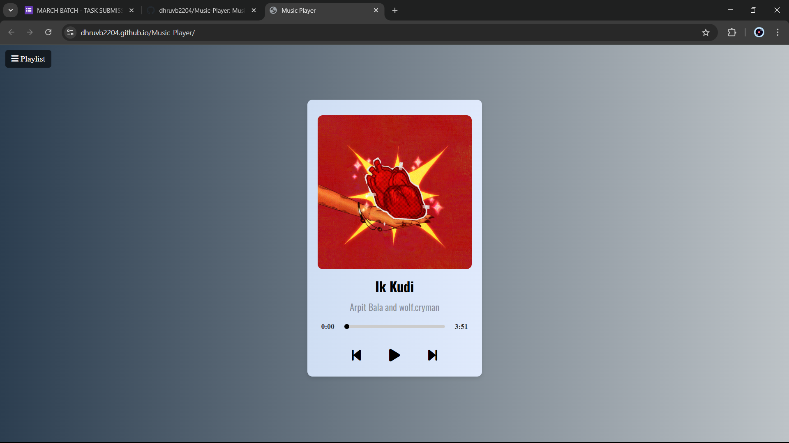

# Music Player

## Overview
This is a simple and visually appealing music player web application built using HTML, CSS, and JavaScript. The player allows users to play, pause, and skip through a playlist of songs with an intuitive interface.

## Features
- Play, Pause, Next, and Previous song controls.
- Display current song information (title, artist, and album art).
- Progress bar to track song duration.
- Responsive design with a modern UI.
- Playlist feature for easy song selection.

## Technologies Used
- **HTML**: Structure of the player.
- **CSS**: Styling and layout design.
- **JavaScript**: Functionality for handling music playback.

## Installation
1. Clone the repository or download the project files.
   ```sh
   git clone https://github.com/yourusername/music-player.git
   ```
2. Navigate to the project folder.
   ```sh
   cd music-player
   ```
3. Open `index.html` in a web browser.

## How to use
- Click the play button to start the music.
- Use the next and previous buttons to switch between songs.
- Adjust the progress bar to seek within a song.
- Open the playlist to select a different track.

## Project Structure
```
music-player/
│── index.html
│── style.css
│── script.js
│── poster/
│── songs/
```

## Screenshot


## Author
Developed by [Dhruv Baldev](https://github.com/dhruvb2204).

## License
This project is open-source and available under the MIT License.

